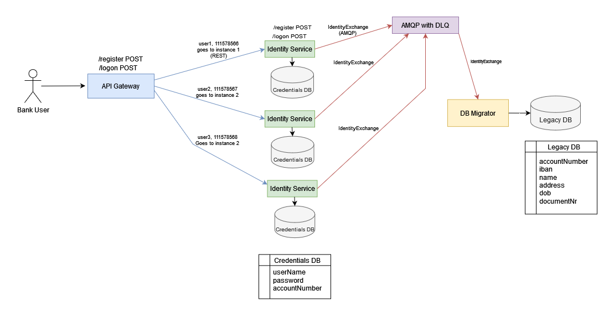

# Bank Account Service

## About The Project
This project includes distributed microservices aimed at enhancing customer service for ABC Bank's legacy database, 
which is currently afflicted with performance issues.

## Data Diagram

Please check the documentation of each service for further details regarding the design of each microservice.

## Runbook

### Dockerizing microservices
Run following commands to dockerize 1 instance of api-gateway, db-migrator, rabbitMQ and 3 instances of identity services.
```bash
docker pull rabbitmq
./build.sh
```

## End-points

Application runs on http://localhost:8080/ as a default configuration

Please check "Bank Account.postman_collection.json", documentation of api-gateway and "apigateway-external-api.yaml" for
definition of external APIs.

## Test Scenarios

 <table>
  <tr>
    <th>Test Condition</th>
    <th>Test Steps</th>
    <th>Test Input</th>
    <th>Test Expected Result</th>
  </tr>
  <tr>
    <td>Check if user can register a new bank account</td>
    <td>
         <ol>
            <li>
            Send a request to register a new bank account
            </li>
        </ol> 
    </td>
    <td>
        {
            "name": "Keano van Dongen",
            "address": "3 hoog Gedeonaweg 637 II, Margarethaambacht, WI 9410 IG",
            "dob": "2020-10-10",
            "documentNr": "vbkpjcnchg6p",
            "userName": "keano"
        }
    </td>
    <td>
         <ul>
            <li>
                200 OK
            </li>
            <li>
                {
                    "userName": "keano",
                    "password": "q72ZtYJ)25irTrI!"
                }
            </li>
        </ul>
    </td>
  </tr>
  <tr>
    <td>Check that user can't register with existing username</td>
    <td>
         <ol>
            <li>
            Send a request to register a new bank account
            </li>
            <li>
            Send a request to register a new bank account with same username
            </li>
        </ol> 
    </td>
    <td>
        {
            "name": "Keano van Dongen",
            "address": "3 hoog Gedeonaweg 637 II, Margarethaambacht, WI 9410 IG",
            "dob": "2020-10-10",
            "documentNr": "vbkpjcnchg6p",
            "userName": "keano23453"
        }
    </td>
    <td>
         <ul>
            <li>
                409 Conflict
            </li>
            <li>
                {
                    "message": "User name is in use"
                }
            </li>
        </ul>
    </td>
  </tr>
  <tr>
    <td>Check that if user can't register to the bank account if identity service can't reach to rabbitMQ server</td>
    <td>
         <ol>
            <li>
            Stop the rabbitMQ instance
            </li>
            <li>
            Send a request to register a new bank account
            </li>
        </ol> 
    </td>
    <td>
        {
            "name": "Keano van Dongen",
            "address": "3 hoog Gedeonaweg 637 II, Margarethaambacht, WI 9410 IG",
            "dob": "2020-10-10",
            "documentNr": "vbkpjcnchg6p",
            "userName": "keano23453"
        }
    </td>
    <td>
         <ul>
            <li>
                500 Internal Server Error
            </li>
            <li>
                {
                  "message": "Internal server error"
                }
            </li>
        </ul>
    </td>
  </tr>
  <tr>
    <td>Check that if user can login to the bank account</td>
    <td>
         <ol>
            <li>
            Send a request to logon to bank account with previously gathered password
            </li>
        </ol> 
    </td>
    <td>
        {
            "userName": "keano",
            "password": "q72ZtYJ)25irTrI"
        }
    </td>
    <td>
         <ul>
            <li>
                204 No content
            </li>
            <li>
                No response body
            </li>
        </ul>
    </td>
  </tr>
  <tr>
    <td>Check that if user can't login to the bank account with wrong password</td>
    <td>
         <ol>
            <li>
            Send a request to logon to bank account with wrong password
            </li>
        </ol> 
    </td>
    <td>
        {
            "userName": "keano",
            "password": "wrong password"
        }
    </td>
    <td>
         <ul>
            <li>
                401 Unauthorized
            </li>
            <li>
                No response body
            </li>
        </ul>
    </td>
  </tr>
  <tr>
    <td>Check that if user can't login to the bank account with missing username</td>
    <td>
         <ol>
            <li>
            Send a request to logon to bank account with missing username
            </li>
        </ol> 
    </td>
    <td>
        {
            "password": "q72ZtYJ)25irTrI"
        }
    </td>
    <td>
         <ul>
            <li>
                400 Bad Request
            </li>
            <li>
                {
                  "message": "userName: must not be null"
                }
            </li>
        </ul>
    </td>
  </tr>
  <tr>
    <td>Check that if user can't login to the bank account with missing password</td>
    <td>
         <ol>
            <li>
            Send a request to logon to bank account with missing password
            </li>
        </ol> 
    </td>
    <td>
        {
            "userName": "keano"
        }
    </td>
    <td>
         <ul>
            <li>
                400 Bad Request
            </li>
            <li>
                {
                  "message": "password: must not be null"
                }
            </li>
        </ul>
    </td>
  </tr>
  <tr>
    <td>Check that if user can't login to the bank account with missing username and password</td>
    <td>
         <ol>
            <li>
            Send a request to logon to bank account with missing username and password
            </li>
        </ol> 
    </td>
    <td>
            Empty response body
    </td>
    <td>
         <ul>
            <li>
                400 Bad Request
            </li>
            <li>
                {
                  "message": "password: must not be null, userName: must not be null"
                }
            </li>
        </ul>
    </td>
  </tr>
</table> 
